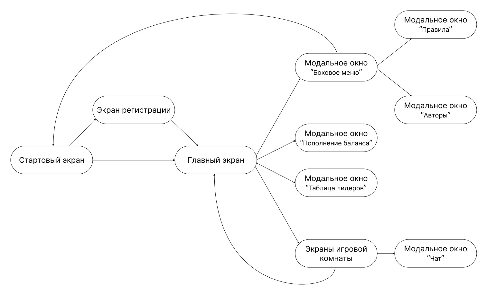
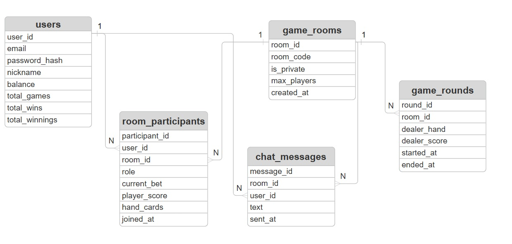

Оглавление

1.Термины и сокращения

2.Состояния пользователей

3.Схема переходов между экранами

4.Требования к экранам приложения

    4.1. Стартовый экран

    4.2. Экран регистрации

    4.3. Главный экран

    4.4. Экран игровой комнаты

    4.5. Модальные окна

5.ER-модель (Entity-Relationship model)

6.Анализ нормализации структуры базы данных по нормальным формам 

    6.1. База данных users

    6.2. База данных rooms

    6.3. База данных room_members

    6.4. База данных messages

    6.5. База данных message_hashes

4. Требования к экранам приложения

    4.1. Стартовый экран
    
        4.1.1. Общее описание
        Стартовый экран является первоначальной точкой входа в приложение. Его основная функция — аутентификация
        существующих пользователей (проверка E-mail и пароля) для предоставления доступа к аккаунту, а также
        предоставление новым пользователям возможности перейти к созданию аккаунта. Экран загружается сразу после
        запуска браузерной версии приложения. Успешная аутентификация перенаправляет пользователя в главное меню (лобби).

        4.1.2. Визуальное оформление
        * Фон: Заставка в минималистичном стиле
        * Название игры: Крупный, стилизованный логотип "КазинОЧКО"
        * Центральная панель (сверху вниз):
            *  Приветственная фраза "Добро пожаловать!"
            *  Форма авторизации: (поле для E-mail, поле для пароля)
            *  Кнопка "Войти": Размещена непосредственно под формой авторизации
            *  Альтернатива для новых пользователей: Текст "Впервые здесь?".
            *  Кнопка "Зарегистрироваться": Размещена под текстом "Впервые здесь?".

        4.1.3. Сценарии развития
            4.1.3.1. Успешная авторизация
            Условие: пользователь уже имеет аккаунт
            Основной поток:
            * Система отображает интерфейс экрана входа (поля "E-mail", "Пароль", кнопки "Войти" и "Зарегистрироваться").
            * Пользователь вводит свой корректный E-mail в соответствующее поле.
            * Пользователь вводит свой пароль.
            * Пользователь нажимает кнопку "Войти".
            * Система отправляет запрос на сервер для аутентификации.
            * Сервер подтверждает совпадение учетных данных.
            * Система перенаправляет пользователя на главный экран (лобби).

            4.1.3.2. Переход к экрану регистрации
            Условие: Пользователь заходит в игру в первый раз и еще не имеет свой аккаунт.
            Основной поток:
            * Пользователь нажимает кнопку "Зарегистрироваться".
            * Система выполняет переход на экран регистрации.

            4.1.3.3. Обработка неудачной авторизации
            Условие: Пользователь ввел данные и нажал кнопку "Войти"
            Основной поток (Ошибка формата):
            * Система выполняет проверку формата введенного E-mail.
            * При обнаружении невалидного формата система отображает сообщение об ошибке "Неверный формат e-mail"

            Альтернативный поток (Ошибка сервера):
            * При валидном формате E-mail система отправляет данные на сервер.
            * При получении ошибки авторизации от сервера система очищает поле ввода пароля и отображает под формой ввода общее сообщение об ошибке.

        4.1.4. Функциональные требования
            4.1.4.1. Элементы интерфейса
            * Поле ввода "E-mail" с плейсхолдером "Ваш e-mail".
            * Поле ввода "Пароль" с плейсхолдером "Пароль" и иконкой "глаз" для показа/скрытия символов.
            * Кнопка "ВОЙТИ", изначально находится в неактивном состоянии
            * Кнопка "Зарегистрироваться", всегда в активном состоянии

            4.1.4.2. Бизнес-логика
            * Кнопка "ВОЙТИ" должна быть неактивна до момента, пока оба поля (E-mail и Пароль) не будут заполнены.
            * При нажатии на кнопку "ВОЙТИ" система должна выполнить проверку формата e-mail(наличие @). При невалидном формате отобразить ошибку "Неверный формат e-mail" непосредственно под полем "E-mail".
            * При успешной проверке формата E-mail система должна отправить данные (E-mail и пароль) на сервер для аутентификации
            * При получении от сервера подтверждения успешной аутентификации система должна перенаправить пользователя на главный экран (лобби).
            * При получении от сервера ошибки аутентификации система должна очистить поле ввода пароля и отобразить под формой ввода сообщение об ошибке: "Неверный e-mail или пароль. Пожалуйста, проверьте введенные данные".
            * Любое сообщение об ошибке, связанное с форматом E-mail, должно быть скрыто при изменении текста в поле "E-mail".
            * При нажатии на кнопку "Зарегистрироваться" система должна осуществить переход на экран регистрации.

    4.2. Экран регистрации

        4.2.1. Общее описание
        Экран регистрации предназначен для создания новой учетной записи. Основная функция экрана — сбор необходимых данных для создания уникального аккаунта. Пользователь попадает на этот экран со стартового экрана после нажатия кнопки "Зарегистрироваться". После успешной регистрации система автоматически создает игровой профиль с начальным балансом виртуальной валюты и перенаправляет пользователя на главный экран (лобби).

        4.2.2.  Визуальное оформление
        *  Фон: Заставка в минималистичном стиле
        *  Заголовок "Регистрация!"
        *  Форма регистрации (сверху вниз): 
            * Поле "E-mail"
            * Поле "Пароль". Должно иметь иконку для показа/скрытия символов. Под полем размещается текст с требованиями к сложности: "Минимум 8 символов, заглавная буква, цифра".
            * Поле "Подтверждение пароля". Должно иметь иконку для показа/скрытия символов.
            * Поле "Игровой псевдоним".

        * Панель с кнопками (слева на право):
            * Кнопка "Авторизация".
            * Кнопка "Создать аккаунт".

        4.2.3. Сценарии развития
            4.2.3.1. Успешная регистрация
            Условие: Пользователь впервые создает аккаунт и вводит корректные данные.
            Основной поток:
            * Пользователь заполняет все обязательные поля формы.
            * Пользователь нажимает кнопку "Зарегистрироваться".
            * Система проводит валидацию в реальном времени: проверяет формат E-mail, сложность пароля и уникальность псевдонима.
            * Система создает новую запись в базе данных.
            * Система автоматически авторизует пользователя.
            * Система начисляет стартовый бонус 5000 кредитов.
            * Система перенаправляет пользователя на главный экран.

            4.2.3.2. Обработка неудачной регистрации
            Условие: Пользователь ввел данные и нажал кнопку "Зарегистрироваться"
            Основной поток (Ошибка формата):
            * Система выполняет проверку формата введенного E-mail.
            * При обнаружении невалидного формата система отображает сообщение об ошибке "Неверный формат e-mail"

            Альтернативный поток 1 (Ошибка сервера):
            * При валидном формате E-mail система отправляет данные на сервер.
            * При получении от сервера ошибки "E-mail уже занят" система показывает сообщение "E-mail уже зарегистрирован"
            
            Альтернативный поток 2 (Ошибка сервера):
            * При валидном формате E-mail система отправляет данные на сервер.
            * При получении ошибки регистрации от сервера (псевдоним уже занят) система оображает сообщение об ошибке "Псевдоним уже занят"

        4.2.4. Функциональные требования
            4.2.4.1. Элементы интерфейса
            * Поле ввода "E-mail" с плейсхолдером "Ваш e-mail".
            * Поле ввода "Пароль" с плейсхолдером "Пароль" и иконкой "глаз" для показа/скрытия символов.
            * Поле ввода "Подтверждение пароля" с плейсхолдером "Повторите пароль" и иконкой "глаз".
            * Поле ввода "Игровой псевдоним" с плейсхолдером "Придумайте псевдоним".
            * Кнопка "Создать аккаунт", изначально неактивна.
            * Кнопка "Авторизация", всегда активна.

            4.2.4.2. Бизнес-логика
            * Кнопка "Создать аккаунт" должна быть неактивна до момента, пока все обязательные поля не будут заполнены корректно.
            * Система должна выполнять валидацию формата E-mail в реальном времени. При ошибке показывать "Неверный формат e-mail".
            * Система должна проверять сложность пароля: минимум 8 символов, заглавная буква, цифра.
            * Система должна проверять совпадение паролей в полях "Пароль" и "Подтверждение пароля".
            * При нажатии на кнопку "Создать аккаунт" система должна отправить данные на сервер для проверки уникальности.
            * При успешной регистрации система должна автоматически авторизовать пользователя, начислить 5000 кредитов и перенаправить на главный экран.
            * При нажатии на кнопку "Авторизация" система должна перейти на стартовый экран.

    4.3. Главный экран

        4.3.1. Общее описание
        Главный экран (лобби) является центральным узлом приложения, предоставляющим доступ ко всем основным функциям игры. Пользователь попадает на этот экран после успешной авторизации или регистрации. Лобби служит отправной точкой для создания новых игровых комнат, присоединения к существующим сессиям, а также предоставляет доступ к настройкам профиля.

        4.3.2.  Визуальное оформление
        * Фон: Размытое изображение игрового стола.
        * Верхний блок (слева направо):
            * Кнопка бокового меню(3 горизонтальные полоски).
            * Имя игрока.
            * Баланс игрока.
            * Кнопка "+".

        * Центральный блок (сверху вниз):
            * Логотип игры "КазинОЧКО".
            * Кнопка "Быстрая игра".
            * Кнопка "Приватная комната".
            * Кнопка "Таблица лидеров".

        * Модальное окно "Боковое меню": 
            Верхняя часть:
            * Имя игрока и кнопка изменить.
            * Статистика: всего игр, всего побед, общая сумма денег, всего часов.

            Нижняя часть:
            * Кнопка "Правила".
            * Кнопка "Авторы".
            * Кнопка "Выйти".

        * Модальное окно "Приватная комната":
            * Кнопка "Создать приватную комнату".
            * Кнопка "Присоединиться к приватной комнате".

        4.3.3. Сценарии развития

            4.3.3.1. Быстрый старт игры
            Условие: Пользователь хочет быстро начать игру.
            Основной поток:
            * Пользователь нажимает кнопку "Быстрая игра".
            * Система ищет свободные комнаты с количеством игроков менее 6.
            * Система автоматически помещает пользователя в найденную комнату в статусе "Зритель".
            * После совершения первой ставки статус автоматически меняется на "Игрок".

            Альтернативный поток (нет свободных комнат):
            * Система не находит свободных комнат.
            * Система создает новую комнату.
            * Система автоматически помещает пользователя в найденную комнату в статусе "Зритель".
            * После совершения первой ставки статус автоматически меняется на "Игрок".

            4.3.3.2. Создание приватной комнаты
            Условие: Пользователь выбирает "Создать приватную комнату" после появления всплывающего окна "Приватная комната".
            Основной поток:
            * Система генерирует уникальный 4-значный цифровой код.
            * Создается новая приватная комната.
            * Система перенаправляет пользователя в созданную комнату.

            4.3.3.3. Присоединение к приватной комнате
            Условие: Пользователь выбирает "Присоединиться к приватной комнате" после появления всплывающего окна "Приватная комната".
            Основной поток:
            * Система отображает окно с полем ввода и заголовком "Введите код комнаты".
            * Пользователь вводит 4-значный цифровой код комнаты.
            * Пользователь нажимает кнопку "Присоединиться".
            * Система отправляет запрос на сервер для проверки существования комнаты с указанным кодом.
            * Сервер подтверждает существование комнаты и наличие свободных мест.
            * Система перенаправляет пользователя в игровую комнату.

            Альтернативный поток (неверный код комнаты):
            * Сервер возвращает ошибку, что комната с указанным кодом не найдена.
            * Система отображает сообщение об ошибке "Комната не найдена. Проверьте правильность кода" под полем ввода.
            * Поле ввода кода очищается для повторного ввода.

            Альтернативный поток (комната заполнена):
            * Сервер возвращает ошибку, что в комнате нет свободных мест.
            * Система отображает сообщение об ошибке "В комнате нет свободных мест."
            * Система перенаправляет пользователя на главный экран.

            4.3.3.4. Просмотр таблицы лидеров
            Условие: Пользователь нажимает кнопку "Таблица лидеров".
            Основной поток: Система отображает рейтинговую таблицу.

            4.3.3.5. Пополнение баланса
            Условие: Пользователь нажимает кнопку "+".
            Основной поток:
            * Система запускает рекламный ролик.
            * После просмотра начисляются кредиты.

            Альтернативный поток (реклама недоступна): Система уведомляет "В данный момент нет доступных предложений".

            4.3.3.6. Работа с боковым меню
            Условие: Пользователь открывает боковое меню.
            Основной поток: Система отображает информацию и кнопки действий.

        4.3.4. Функциональные требования

            4.3.4.1. Элементы интерфейса
            * Кнопка "Быстрая игра".
            * Кнопка "Приватная комната".
            * Кнопка "Таблица лидеров".
            * Кнопка "+" для пополнения баланса, расположенная рядом с отображением текущего баланса.
            * Кнопка меню (три полоски).
            * Модальное окно "Приватная комната" с кнопками:
                * "Создать приватную комнату"
                * "Присоединиться к приватной комнате"
            * Модальное окно ввода кода комнаты с:
                * Полем ввода с плейсхолдером "Введите 4-х значный код"
                * Кнопкой "Присоединиться"
                * Кнопкой "Отмена"
                * Модальное боковое меню, содержащее:
                    * Имя игрока и кнопку "Изменить"
                    * Статистику: "Всего игр", "Всего побед", "Сумма выигрыша", "Время в игре"
                    * Кнопку "Правила игры"
                    * Кнопку "Об авторах"
                    * Кнопку "Выйти"

            4.3.4.2. Бизнес-логика
            * При нажатии на кнопку "Быстрая игра" система должна искать комнаты с количеством игроков менее 6.
            * При отсутствии доступных комнат система должна автоматически создать новую комнату.
            * При присоединении к комнате пользователю должен присваиваться статус "Зритель".
            * После совершения первой ставки статус пользователя должен автоматически меняться на "Игрок".
            * При нажатии на кнопку "Приватная комната" система должна отображать всплывающее окно с выбором действия.
            * При выборе "Создать приватную комнату" система должна сгенерировать уникальный 4-х значный цифровой код и создать комнату.
            * При выборе "Присоединиться к приватной комнате" система должна запросить ввод кода комнаты.
            * Система должна проверять существование комнаты по введенному коду и наличие в ней свободных мест.
            * При неверном коде система должна отображать ошибку "Комната не найдена. Проверьте правильность кода".
            * При отсутствии свободных мест система должна отображать ошибку "В комнате нет свободных мест".
            * При нажатии на кнопку "+" система должна запускать рекламный ролик и после просмотра начислять кредиты.
            * При отсутствии доступной рекламы система должна отображать уведомление "В данный момент нет доступных предложений".
            * При нажатии на кнопку бокового меню система должна отображать всплывающее меню с актуальной статистикой пользователя.
            * При нажатии на кнопку "Изменить" в боковом меню система должна отображать всплывающее окно с полем для смены имени.
            * При нажатии на кнопку "Выйти" в боковом меню система должна разрывать сессию и перенаправлять пользователя на стартовый экран.

    4.4. Экраны игровой комнаты (Общая комната, приватная комната, комната зрителя)
        
        4.4.1. Общее описание:
        Игровая комната является основным пространством для проведения игровых сессий в блэкджек. Пользователь попадает в комнату после выбора одного из режимов в лобби: "Быстрая игра", "Приватная комната". Комната предназначена для многопользовательской игры против крупье, где участники делают ставки виртуальной валютой и принимают стратегические решения в режиме реального времени. Экран обеспечивает полный игровой процесс: от размещения ставок и получения карт до подведения итогов раунда и обновления балансов участников.

        4.4.2. Виды комнат:
        * Общая игровая комната. Пользователь попадает в это пространоство после выбора режима "Быстрая игра" в лобби. Комната предназначена для всех пользователей, имеет общий функционал. 
        * Приватная комната. Пользователь попадает в пространство после выбора режима "Приватная комната" в лобби. Комната предназначена для пользователей, желающих играть с друзьями. Помимо общего функционала, в комнате реализуется возможность приглашения гостей с помощью 4-значного кода. 
        * Комната зрителя. Является первоначальным экраном после выбора поьзователем любого из режимов. Имеет ограниченный функционал. 

        4.4.3. Визуальное оформление
        * Общий стиль: Классический игровой стол в казино-стиле. Зеленое поле в форме полукруга, рассчитанное на 6 игроков. В верхней части стола расположена зона дилера.
        * Левая часть экрана:
            Вверху:
            * Кнопка "←" для выхода из игры.
            * Кнопка "✓" для подтверждения выхода. Изначально неактивна.

            Внизу (Недоступно в комнате зрителя): 
            * Кнопка "Сплит". Изначально находится в неактивном состоянии.
            * Кнопка "Взять карту".
            * Кнопка "Отказаться".

        * Центральная часть экрана (игровой стол):
            Верхняя зона (слева направо):
            * Поле "Таймер".
            * Поле "Очки диллера".
            * Поле "Ставка". Поле содержит в себе информацию о счете игрока, о размере ставки, кнопки увеличения/уменьшения ставки на 50 монет и увеличения/уменьшения ставки в 2 раза.

            Центральная зона:
            * Поле с картами крупье. Отображаются согласно документу "Rules".
            * Cтилизованный логотип "КазинОЧКО".

            Нижнаяя зона:
            * Карты игроков. 6 рук лежат полукругом, по периметру стола. 
            * Рядом с картами находятся поля с информацией об игроках за столом: 
                * Отображаются имена других игроков.
                * Их текущие ставки.
                * Их очки.

        * Правая часть экрана:
            * Кнопка для открытия чата. Находится в верхнем углу.        
            * Отображение карт игрока. (Недоступно в комнате зрителя).

        * Поле с уникальным 4-значным кодом комнаты. Находится внизу под игровым столом. Доступно только в приватной комнате.
        * Информационная надпись "Вы наблюдатель". Находится в нижнем левом углу. Доступно только в комнате зрителя.

        4.4.4. Сценарии развития

            4.4.4.1. Игра в комнате
            Условие: В приватной комнате есть минимум один игрок со подтвержденной ставкой.
            Основной поток:
            * Фаза ожидания ставок:
                * Система отображает таймер обратного отсчета ("Rules" п.6.2)
                * Новые игроки могут присоединяться и делать ставки ("Rules" п.7.1)

            * Начало раунда:
                * По истечении 30 секунд система автоматически начинает раунд
                * Дилер раздает карты согласно документу "Rules"

            * Фаза принятия решений:
                * Система последовательно активирует ход каждого игрока
                * Для активного игрока доступны действия согласно "Rules" п.4.3
                * Таймер хода согласно "Rules" п.6.1

            * Ход дилера:
                * После завершения ходов всех игроков дилер открывает скрытую карту
                * Система автоматически играет за дилера по правилам "Rules" п.4.4

            * Определение результатов:
                * Блэкджек (21 очко с двумя картами) - выплата 3:2 ("Rules" п.7.4)
                * Победа - выплата 1:1 ("Rules" п.7.3)
                * Ничья (пуш) - ставка отходит к крупье ("Rules" п.5)
                * Проигрыш (перебор или меньшая сумма) - потеря ставки

            * Завершение раунда:
                * Обновляются балансы игроков
                * Карты сбрасываются
                * Автоматический переход к новой фазе ставок
            
            Альтернативный поток 1 (Превышение времени на ход): Если игрок не выбирает действие за 15 секунд ("Rules" п.6.1) система автоматически выбирает действие "Остановиться".

            Альтернативный поток 2 (Недостаточно средств для ставки):
            * Если баланс игрока <100 кредитов ("Rules" п.7.1):
                * Игрок автоматически переходит в статус "Зритель"
                * Для игры необходимо пополнить баланс

            4.4.4.2. Взаимодействие с чатом
            Условие: Пользователь находится в игровой комнате.
            Основной поток:
            * Пользователь нажимает кнопку чата в правом верхнем углу
            * Система отображает окно чата с историей сообщений
            * Пользователь вводит сообщение и отправляет его
            * Сообщение появляется у всех участников комнаты

        4.4.5. Функциональные требования

            4.4.5.1. Элементы интерфейса игровой комнаты
            * Кнопка "←" для выхода из игры
            * Кнопка "✓" для подтверждения выхода (изначально неактивна)
            * Кнопка "Сплит" (активна только при двух картах одинакового достоинства)
            * Кнопка "Взять карту"
            * Кнопка "Остановиться"
            * Поле "Таймер" с обратным отсчетом времени
            * Поле "Очки дилера" с отображением текущей суммы очков
            * Поле "Ставка" с элементами:
                * Отображение текущего баланса игрока
                * Отображение размера текущей ставки
                * Кнопки "-50" и "+50" для изменения ставки
                * Кнопки "÷2" и "×2" для изменения ставки
                * Кнопка "Подтвердить ставку"
            * Поле с картами дилера (отображаются согласно правилам)
            * Зона карт игроков (6 позиций полукругом)
            * Информационные поля для каждого игрока:
                * Имя игрока
                * Размер текущей ставки
                * Очки игрока
            * Кнопка открытия чата в правом верхнем углу
            * Поле отображения карт текущего игрока
            * Поле с 4-значным кодом комнаты (только для приватных комнат)
            * Информационная надпись "Вы наблюдатель" (для режима зрителя)

            4.4.5.2. Бизнес-логика игрового процесса
            * При входе в комнату пользователю должен присваиваться статус "Зритель"
            * При установке ставки ≥100 кредитов статус должен автоматически меняться на "Игрок"
            * Система должна отображать обратный отсчет 30 секунд для фазы ставок
            * По истечении 30 секунд система должна автоматически начинать игровой раунд
            * При раздаче карт дилер должен получать одну открытую и одну закрытую карту
            * Система должна последовательно активировать ход каждого игрока
            * Для активного игрока должны быть доступны действия: "Взять карту", "Остановиться"
            * Кнопка "Сплит" должна активироваться только при двух картах одинакового достоинства
            * Система должна предоставлять 15 секунд на принятие решения каждым игроком
            * При превышении времени система должна автоматически выбирать действие "Остановиться"
            * После завершения ходов игроков система должна автоматически играть за дилера по правилам
            * Система должна рассчитывать результаты согласно правилам выплат:
                * Блэкджек: выплата 3:2
                * Победа: выплата 1:1
                * Ничья: ставка отходит дилеру
                * Проигрыш: потеря ставки
            * После завершения раунда система должна автоматически переходить к новой фазе ставок
            * При балансе менее 100 кредитов игрок должен автоматически переходить в статус "Зритель"

            4.4.5.3. Бизнес-логика чата
            * При нажатии на кнопку чата система должна отображать окно с историей сообщений
            * Система должна отправлять сообщения всем участникам комнаты в реальном времени
            * При отправке сообщения оно должно сразу появляться в чате у всех игроков

            4.4.5.4. Бизнес-логика навигации
            * При нажатии кнопки "←" система должна активировать кнопку подтверждения выхода
            * При подтверждении выхода система должна перенаправлять пользователя в лобби
            * При выходе во время активного раунда система должна списывать текущую ставку
            * В приватной комнате система должна отображать код комнаты для приглашения
            * При нажатии на код комнаты система должна копировать его в буфер обмена
            * При нажатии на кнопку "Выйти" в боковом меню система должна разрывать сессию и перенаправлять пользователя на стартовый экран

    4.5. Модальные окна

        4.5.1. Таблица лидеров

            4.5.1.1. Общее описание:
            Экран отображает рейтинговую таблицу игроков, отсортированную по убыванию суммы выигрыша. Является частью системы социального взаимодействия и соревновательного элемента игры.

            4.5.1.2. Визуальное оформление:
            * Фон: Полупрозрачный темный оверлей (как на других модальных окнах приложения)
            * Контейнер: Центральная панель с закругленными углами в минималистичном стиле, соответствующем общему дизайну игры. 
            * Заголовок: Стилизованная надпись "Таблица лидеров" в верхней части контейнера

            4.5.1.3. Структура и содержимое:
            * Колонки таблицы (слева направо):
                * Позиция - номер места в рейтинге 
                * Игрок - никнейм пользователя 
                * Выигрыш - общая сумма выигрыша в кредитах 
            * Формат отображения:
                * Первые 3 позиции выделяются специальными иконками 
                * Текущий пользователь выделяется контрастным цветом рамки
                * Числовые значения отображаются с разделителями разрядов (100 000 000)

            4.5.1.4. Функциональные требования:
            * Сортировка: Автоматическая сортировка по убыванию суммы выигрыша
            * Обновление данных: Автоматическое обновление при открытии окна
            * Навигация: Кнопка закрытия в верхнем правом углу

        4.5.2. Об авторах

            4.5.2.1. Общее описание:
            Модальное окно отображает информацию о командах, участвовавших в разработке приложения — дизайнеры, программисты, аналитики и руководители проекта. Служит для признания вклада участников и повышения доверия к продукту.

            4.5.2.2. Визуальное оформление:
            * Фон: Полупрозрачный темный оверлей (как на других модальных окнах приложения)
            * Контейнер: Центральная панель с закругленными углами в минималистичном стиле, соответствующем общему дизайну игры. 
            * Заголовок: Надпись «Авторы» в верхней части контейнера.
            * Под заголовком — логотип игры «CASINOCHKO», выполненный в фирменном стиле.
            * Кнопка закрытия: Крестик (×) в правом верхнем углу контейнера.
            * Кнопка «Назад»: Стрелка и текст «< назад» в нижней левой части окна — для возврата в предыдущий экран (боковое меню).

            4.5.2.3. Структура и содержимое:
            Информация представлена в виде трёх колонок, каждая из которых содержит роль и имена участников:
                Левая колонка:
                * тимлидер → Самарин Михаил
                * дизайнер → Бекмансуров Влад
                * аналитик → Уракова Юлия

                Центральная колонка:
                * руководитель проекта → Трусов Алексей
                * frontend-программисты → Мурин Виктор, Максимов Александр, Муртазина Камила, Мамедова Айсун, Заборникова Юлия
                
                Правая колонка:
                * backend-программисты → Моромов Никита, Хачатуриян Глеб, Лотов Иван, Сметанин Егор, Хохряков Роман, Субботин Антон

            4.5.2.4. Функциональные требования:
            * Отображение данных: Информация статична — не обновляется динамически.
            * Навигация:
                Закрытие окна — по клику на кнопку × или вне контейнера.
                Возврат в боковое меню — по клику на ссылку «< назад».
            * Доступность: Окно открывается только из бокового меню (кнопка «Об авторах»).
            * Адаптивность: На мобильных устройствах колонки могут перестраиваться в одну вертикальную последовательность.

        4.5.3. Окно ставок

            4.5.3.1. Общее описание:
            Модальное окно предназначено для выбора размера ставки перед началом игрового раунда. Позволяет игроку увеличивать или уменьшать ставку с помощью кнопок, а также подтверждать или отменять действие. Является обязательным этапом перед участием в игре.

            4.5.3.2. Визуальное оформление:
            * Фон: Полупрозрачный тёмный оверлей, затемняющий основной экран.
            * Контейнер: Центральная панель с закруглёнными углами, обрамлённая яркой жёлтой линией — выделяет окно как активное и важное.
            * Заголовок: Надпись «Сделать ставку» в верхней части контейнера.
            * Информация о балансе: Под заголовком — строка «Ваш баланс: [сумма]».
            * Центральный элемент: Поле со значением текущей ставки — по умолчанию «0».
            * Кнопки управления:
                * Кнопка «–50» — слева от поля ставки.
                * Кнопка «+50» — справа от поля ставки.
            * Кнопки действий внизу:
                * Слева — «< отмена».
                * Справа — «> поставить».

            4.5.3.3. Структура и содержимое
            * Текущий баланс пользователя (неизменяемый, только для просмотра).
            * Текущую выбранную ставку — изменяется при нажатии на кнопки «+50» / «–50».
            * Кнопки управления ставкой:
                * +50 — увеличивает ставку на 50 кредитов (до максимума баланса).
                * –50 — уменьшает ставку на 50 кредитов (не ниже 0).
            * Кнопки подтверждения:
                * «Отмена» — закрывает окно без изменения ставки.
                * «Поставить» — подтверждает ставку, если она ≥100 — переводит игрока в режим «Игрок», если меньше — блокирует действие.

            4.5.3.4. Функциональные требования
            * Минимальная ставка: Игрок может сделать ставку от 0 до своего текущего баланса, но для участия в игре ставка должна быть ≥100.
            * Логика кнопок:
                * При нажатии «+50» — значение ставки увеличивается на 50, пока не достигнет баланса.
                * При нажатии «–50» — значение уменьшается на 50, но не опускается ниже 0.
                * Кнопка «Поставить» активна только при ставке ≥100.
                * При попытке поставить <100 — система показывает ошибку (например, всплывающее сообщение: «Минимальная ставка — 100»).
            * Обновление данных:
                * Баланс обновляется в реальном времени при изменении ставки.
                * После подтверждения — ставка фиксируется, баланс уменьшается, игрок переходит в статус «Игрок».
            * Навигация:
                * Закрытие окна — по клику на «Отмена» или вне контейнера.
                * Подтверждение — по клику на «Поставить» → переход к игровому процессу.
            * Безопасность:
                * Система не позволяет поставить больше, чем есть на балансе.
                * При нулевой ставке — игрок остаётся в режиме «Зритель».

        4.5.4. Окно чата

            4.5.4.1. Общее описание:
            Модальное окно чата позволяет игрокам обмениваться сообщениями в реальном времени во время игровой сессии. Предназначено для социального взаимодействия, стратегического общения или просто для общения между участниками комнаты.

            4.5.4.2. Визуальное оформление: 
            * Фон: Полупрозрачный тёмный оверлей, затемняющий основной экран.
            * Контейнер: Центральная панель с закруглёнными углами, выполненная в минималистичном стиле, соответствующем общему дизайну приложения.
            * Заголовок: Надпись «Чат» в верхнем левом углу контейнера.
            * Область сообщений: Список сообщений, отображаемых сверху вниз. Сообщения разделены тонкой горизонтальной линией.Каждое сообщение содержит: никнейм отправителя и текст сообщения.
            * Поле ввода: В нижней части контейнера — строка ввода с плейсхолдером «написать...».
            * Кнопка отправки: Справа от поля ввода — кнопка «> отправить».

            4.5.4.3. Структура и содержимое:
            Окно состоит из двух основных частей:
            * История сообщений: отображаются все сообщения, отправленные в текущей комнате, начиная с самых старых.
            * Панель ввода:
                * Поле ввода текста с подсказкой «написать...».
                * Кнопка «> отправить» — активна только при наличии текста в поле.
                * При отправке сообщения — оно мгновенно появляется в истории и рассылается всем участникам комнаты.

            4.5.4.4. Функциональные требования
            * Отправка сообщений:
                * Сообщения отправляются в реальном времени всем участникам комнаты.
                * После отправки поле ввода очищается.
                * Максимальная длина сообщения — 500 символов.
                * При попытке отправить пустое сообщение — кнопка неактивна.
            * Отображение сообщений:
                * Сообщения отсортированы по времени (сверху — самые старые, снизу — новые).
                * Автоматическая прокрутка вниз при появлении нового сообщения.
                * Никнеймы не редактируются — отображаются как есть.
            * Навигация:
                * Закрытие окна — по клику вне контейнера или по кнопке «×» (если добавлена).
                * Чат остаётся открытым до тех пор, пока пользователь его не закроет — не блокирует игровой процесс.

6. Анализ нормализации структуры базы данных по нормальным формам 

    6.1. База данных users
    * База данных users находится в первой нормальной форме, поскольку все её атрибуты — id, email, password, balance, token, total_played, total_win и total_balance — содержат атомарные, неделимые значения, а повторяющихся групп или массивов в записях нет.
    * Вторая нормальная форма соблюдена: первичный ключ таблицы — простой (id), и каждый неключевой атрибут зависит от всего этого ключа, а не от его части (что исключено при одноатрибутном ключе).
    * Третья нормальная форма также выполнена: отсутствуют транзитивные зависимости. Все неключевые атрибуты зависят непосредственно от идентификатора пользователя, и между самими атрибутами (например, между balance и total_balance) нет функциональных связей, которые бы определяли одно поле через другое на уровне схемы.
    * Четвёртая нормальная форма соблюдена, так как в таблице отсутствуют многозначные зависимости — каждый пользователь имеет ровно одно значение для каждого атрибута, и нет независимых множеств значений, связанных с одним ключом.
    * Пятая нормальная форма выполняется, поскольку база данных описывает простую сущность «Пользователь» без сложных join-зависимостей, требующих трёхсторонней декомпозиции.
    * Шестая нормальная форма не соблюдена, так как база данных содержит несколько неключевых атрибутов. Однако это оправдано: система не предполагает хранения истории изменений отдельных полей (например, динамики баланса во времени), а 6НФ применяется преимущественно в темпоральных базах данных. Таким образом, отклонение от 6НФ является целесообразным.

    6.2 База данных rooms
    * База данных rooms удовлетворяет первой нормальной форме: все поля (id, type, status, current_member_id, private_code, hash) являются скалярными и атомарными.
    * Вторая нормальная форма соблюдена благодаря использованию простого первичного ключа id, от которого зависят все остальные атрибуты.
    * Третья нормальная форма выполняется: несмотря на то, что поле private_code имеет смысл только при type = 'private', значение private_code не определяется функционально значением type — оно генерируется независимо и уникально. Следовательно, транзитивных зависимостей нет.
    * Четвёртая нормальная форма соблюдена, так как у каждой комнаты ровно одно состояние по каждому из атрибутов — нет множественных, независимых наборов значений.
    * Пятая нормальная форма также соблюдена: база данных представляет собой простую сущность без составных join-зависимостей.
    * Шестая нормальная форма не достигнута, поскольку база данных включает несколько неключевых атрибутов. Это допустимо, так как приложение не требует поатрибутного версионирования или независимого отслеживания изменений.

    6.3. База данных room_members
    * База данных room_members находится в первой нормальной форме: все атрибуты (id, room_id, user_id, bet, types) — атомарные.
    * Вторая нормальная форма выполнена: первичный ключ — id (суррогатный, простой), и все поля зависят от него целиком.
    * Третья нормальная форма соблюдена: атрибуты bet и types не определяются ни через room_id, ни через user_id по отдельности — они зависят от конкретного участия пользователя в комнате, что идентифицируется записью (через id). Транзитивных зависимостей нет.
    * Четвёртая нормальная форма соблюдена: каждая запись отражает единственный тип участия (игрок или зритель) с одной ставкой — нет независимых множеств значений для одного ключа.
    * Пятая нормальная форма выполняется: связь между пользователем и комнатой является стандартной ассоциацией «многие-ко-многим» с дополнительными атрибутами, не порождающей сложных join-зависимостей.

    6.4. База данных messages
    * База данных messages соответствует первой нормальной форме: все поля (id, room_id, user_id, message, created) содержат простые, неделимые значения.
    * Вторая нормальная форма соблюдена, так как первичный ключ — id, и все атрибуты зависят от него.
    * Третья нормальная форма выполнена: нет транзитивных зависимостей. Например, room_id не определяет содержание message, а user_id не определяет время created вне контекста конкретного сообщения.
    * Четвёртая нормальная форма соблюдена: каждое сообщение имеет ровно одно значение для каждого атрибута — не существует множественных, независимых списков, связанных с одним ключом.
    * Пятая нормальная форма также соблюдена: база данных моделирует простое событие — отправку сообщения — без сложных многомерных зависимостей.

    6.5. База данных message_hashes
    * База данных message_hashes находится в первой нормальной форме: атрибуты id, room_id и hash — атомарные.
    * Вторая нормальная форма соблюдена благодаря простому первичному ключу id.
    * Третья нормальная форма выполняется: хотя логически хэш зависит от комнаты (room_id → hash), в текущей схеме с первичным ключом id все атрибуты зависят от id, и транзитивных зависимостей от ключа не возникает. При этом, если бы room_id был объявлен уникальным, это не нарушило бы 3НФ.
    * Четвёртая нормальная форма соблюдена: каждая комната имеет не более одного хэша, следовательно, многозначных зависимостей нет.
    * Пятая нормальная форма выполнена: база данных отражает простое агрегированное состояние (хэш чата по комнате), не вовлечённое в сложные join-зависимости.

7. Структура базы данных и предложения по оптимизации

    7.1. Классификация таблиц
    База данных системы включает три типа таблиц: сущностные, связующие и вспомогательные.

    * Сущностные таблицы — это основные таблицы, в которых хранятся данные об объектах системы. К ним относятся:
    — users — содержит данные о пользователях: идентификатор, email, хэш пароля, игровой баланс, токен сессии, а также счётчики игр (total_played, total_win, total_balance).
    — rooms — описывает игровые комнаты: уникальный идентификатор, тип (public/private), текущий статус, идентификатор активного участника, приватный код (для закрытых комнат) и хэш состояния чата.

    * Связующие таблицы реализуют отношения между сущностями и могут содержать дополнительные атрибуты, характеризующие контекст связи. К ним относятся:
    — room_members — фиксирует участие пользователя в комнате и включает ставку (bet) и роль (types: игрок или зритель).
    — messages — хранит сообщения, отправленные пользователями в чатах комнат, с указанием времени отправки.

    * Вспомогательные таблицы предназначены для хранения производных данных, упрощающих обработку и проверку целостности. К ним относятся:
    — message_hashes — содержит контрольные хэши сообщений по каждой комнате, используемые, например, для быстрой проверки неизменности чата.

    7.2. Предложения по оптимизации на уровне индексов
    * В таблице users следует добавить уникальный индекс по полю email — это ускорит процедуру аутентификации и предотвратит дублирование учётных записей. Также можно создать индекс по полю token для быстрой валидации сессий.

    * В таблице rooms рекомендуется создать индекс по полю status, чтобы эффективно выбирать комнаты в нужном состоянии (например, «ожидающие» или «активные»). Для приватных комнат необходимо обеспечить уникальность и быстрый поиск по полю private_code — для этого создаётся уникальный индекс.

    * В таблице room_members необходимо создать уникальный составной индекс по полям room_id и user_id, чтобы исключить повторное добавление одного пользователя в одну и ту же комнату. Также следует добавить индекс по user_id для быстрого получения списка всех комнат, в которых участвует пользователь, и индекс по room_id вместе с types, если система часто фильтрует участников по роли (игрок/зритель).

    * В таблице messages можго создать составной индекс по полям room_id и created — это обеспечит эффективную загрузку хронологии чата в порядке времени без полного сканирования таблицы.

    * В таблице message_hashes рекомендуется создать уникальный индекс по полю room_id, так как каждая комната должна иметь не более одного хэша чата